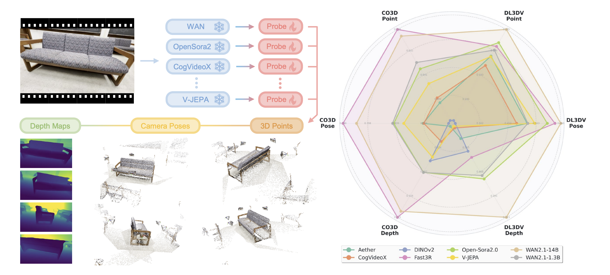

# VidFM3D: How Much 3D Do Video Foundation Models Encode?

[](https://arxiv.org/pdf/2512.19949v1)
[](https://vidfm-3d-probe.github.io/)



## Installation

```bash
# create conda environment
conda create -n vidfm3d python=3.11 cmake=3.14.0 -y
conda activate vidfm3d

# install PyTorch (adjust versions according to your system)
conda install pytorch torchvision torchaudio pytorch-cuda=12.4 nvidia/label/cuda-12.4.0::cuda-toolkit -c pytorch -c nvidia

# install PyTorch3D from source (the compilation will take a while)
# export MAX_JOBS=6 # un-comment this if your machine is low on RAM (e.g., 16GB) when compiling PyTorch3D
pip install "git+https://github.com/facebookresearch/pytorch3d.git@stable" --no-build-isolation
# unset MAX_JOBS

# install requirements
pip install -r requirements.txt

# install vidfm3d as a package (so you can import vidfm3d and use it in your own project)
pip install -e .
```

<details>
<summary>Installation Troubleshooting</summary>

**CUDA Runtime Error**
If you encounter the error `fatal error: cuda_runtime.h: No such file or directory` when installing PyTorch3D, try setting `CUDA_HOME` before installing PyTorch3D:

```bash
export CUDA_HOME=/usr/local/cuda-12.4
pip install "git+https://github.com/facebookresearch/pytorch3d.git@stable"
```

**PyTorch Import Error (iJIT_NotifyEvent)**
If you encounter `ImportError: ... libtorch_cpu.so: undefined symbol: iJIT_NotifyEvent` when running `import torch`, it is likely due to an incompatibility with newer versions of Intel MKL. Downgrade `mkl` and `intel-openmp` by running:

```bash
conda install "mkl<2024.1" "intel-openmp<2024.1" -c conda-forge -y
```

**Unsupported GNU Version (GCC Compiler Error)**
If PyTorch3D compilation fails with #error -- unsupported GNU version! gcc versions later than X are not supported!, your C++ compiler is too new for your specific CUDA version (e.g., CUDA 12.4 strictly requires GCC 13 or older). If your system already has a compatible GCC version (check with gcc --version), but Conda is overriding it with a newer one, force the build to use your system's compiler. Otherwise, you can install one directly into your Conda environment. 

</details>

## Dataset Preparation

### CO3Dv2

1. **Download** the raw CO3Dv2 dataset following [the official instructions](https://github.com/facebookresearch/co3d). Place (or symlink) the downloaded categories under `vidfm3d/data/CO3D/CO3D-data/`.

2. **Extract frames**: crops each sequence to a fixed aspect ratio (16:9 by default), subsamples to 81 frames, and rejects poorly-cropped sequences:
```bash
python -m vidfm3d.data.processing.co3d.extract_frames \
    --raw_root vidfm3d/data/CO3D/CO3D-data \
    --out_root vidfm3d/data/CO3D/CO3D-raw \
    --stride 1 --num_frames 81 \
    --trunc_thresh 0.25 --resize_to 960 540
```

3. **Extract ground-truth point maps** using VGGT:
```bash
python -m vidfm3d.data.processing.process_co3d --root vidfm3d/data/CO3D
```

### DL3DV

1. **Download** `DL3DV-10K` from [HuggingFace](https://huggingface.co/datasets/DL3DV/DL3DV-10K) and place (or symlink) it under `vidfm3d/data/DL3DV/DL3DV-10K/`. The dataset already comes with extracted frames, no additional frame extraction step is needed.

2. **Extract ground-truth point maps** using VGGT:
```bash
python -m vidfm3d.data.processing.process_dl3dv --root vidfm3d/data/DL3DV
```

## Feature Extraction

Use the following command to extract features (using WAN2.1-1.3B as example):

```bash
python -m features.run_co3d \
  --vfm wan \
  --subset all \
  --model-id Wan-AI/Wan2.1-T2V-1.3B-Diffusers \
  --prompt "" \
  --output-layers 20 \
  --t 749

python -m features.run_dl3dv \
  --vfm wan \
  --subset all \
  --model-id Wan-AI/Wan2.1-T2V-1.3B-Diffusers \
  --prompt "" \
  --output-layers 20 \
  --t 749
```
Different VFMs may require different arguments; see the top of `features/run_co3d.py` or `features/run_dl3dv.py` for per-model examples.

<details>
<summary>Adding a new feature extractor</summary>

Create a folder under `features/` with an `extract_features.py` (see `cogvideox/`, `wan/`, `aether/`, `opensora/` as references). For diffusion models, verify the extraction is correct before training — common failure modes include wrong scaling and incorrect conditioning. It helps to include a full denoising loop for debugging; compare `cogvideox_feature.py` vs `cogvideox_feature_denoise.py` or `wan_feature.py` vs `wan_feature_denoise.py` as examples.

</details>

## Training

Train model with chosen experiment configuration from [configs/experiment/](configs/experiment/). For example, to train probe for WAN2.1-1.3B on both datasets:

```bash
python vidfm3d/train.py experiment=co3d/wan job_name=wan
python vidfm3d/train.py experiment=dl3dv/wan job_name=wan
```

You can override any parameter from command line following [Hydra override syntax](https://hydra.cc/docs/advanced/override_grammar/basic/). All the logging can be found on wandb.

## Evaluation & Visualization

### Quantitative Metrics

Export final metrics from local W&B logs to CSV:
```bash
python scripts/parse_results.py \
  --groups dl3dv,co3d \
  --runs wan \
  --metrics "val/Auc_30,val/pmap_mse_aligned,val/loss_depth"
```
`--metrics` supports wildcard patterns (e.g. `val/*`). Per-run CSVs are written to `logs/metrics/<group>/<run>.csv` and a joint CSV to `logs/metrics/<group>/joint.csv`.

### Qualitative Visualization

The training val loop skips saving viser artifacts. To generate them, run the test loop explicitly:
```bash
python vidfm3d/train.py experiment=co3d/wan task_name=co3d-eval job_name=wan train=false test=true ckpt_path=/path/to/checkpoints/last.ckpt
```
Results are saved to `logs/{task_name}/runs/{task_name}_{job_name}/` (e.g. `logs/co3d-eval/runs/co3d-eval_wan/`), with two subdirectories:
- `viser_viz/` — interactive point cloud and camera visualization
- `viz/val/epoch_0/` — depth maps, confidence maps, and images

To view a 3D scene, port-forward and run:
```bash
python scripts/viser_view.py --scene logs/co3d-eval/runs/co3d-eval_wan/viser_viz/batch_0_sample_0_pred
python scripts/viser_view.py --scene logs/co3d-eval/runs/co3d-eval_wan/viser_viz/batch_0_sample_0_gt
```
For apples-to-apples comparison across methods, copy the pose string from one viser session and paste it into others to lock the viewpoint.

### Figure Plotting

The radar plot compares multiple methods at once: run `parse_results.py` with all desired methods in `--runs` first so the joint CSV contains one row per method. Then:
```bash
python scripts/plot_radar.py \
  --csv logs/metrics/co3d/joint.csv \
  --out results/radar_co3d.png
```

## Citation

```bibtex
@article{huang2025vidfm3d,
  title   = {How Much 3D Do Video Foundation Models Encode?},
  author  = {Huang, Zixuan and Li, Xiang and Lv, Zhaoyang and Rehg, James M.},
  booktitle = {arXiv preprint arXiv:2512.19949},
  year    = {2025}
}
```

## Acknowledgments & Licenses

This project builds on code from the following awesome repositories, which retain their original licenses:
- **[Fast3R](https://github.com/facebookresearch/fast3r)**: training & data infrastructure.
 - **[VGGT](https://github.com/facebookresearch/vggt)**: architecture and data processing.

Foundation models evaluated in this work, each under its own license:
- **[WAN 2.1](https://github.com/Wan-Video/Wan2.1)**
- **[CogVideoX](https://github.com/THUDM/CogVideo)**
- **[Open-Sora](https://github.com/hpcaitech/Open-Sora)**
- **[Aether](https://github.com/OpenRobotLab/Aether)**
- **[V-JEPA](https://github.com/facebookresearch/jepa)**
- **[DINOv2](https://github.com/facebookresearch/dinov2)**
- **[Fast3R](https://github.com/facebookresearch/fast3r)**

Please refer to each repository for its full license and terms of use.
